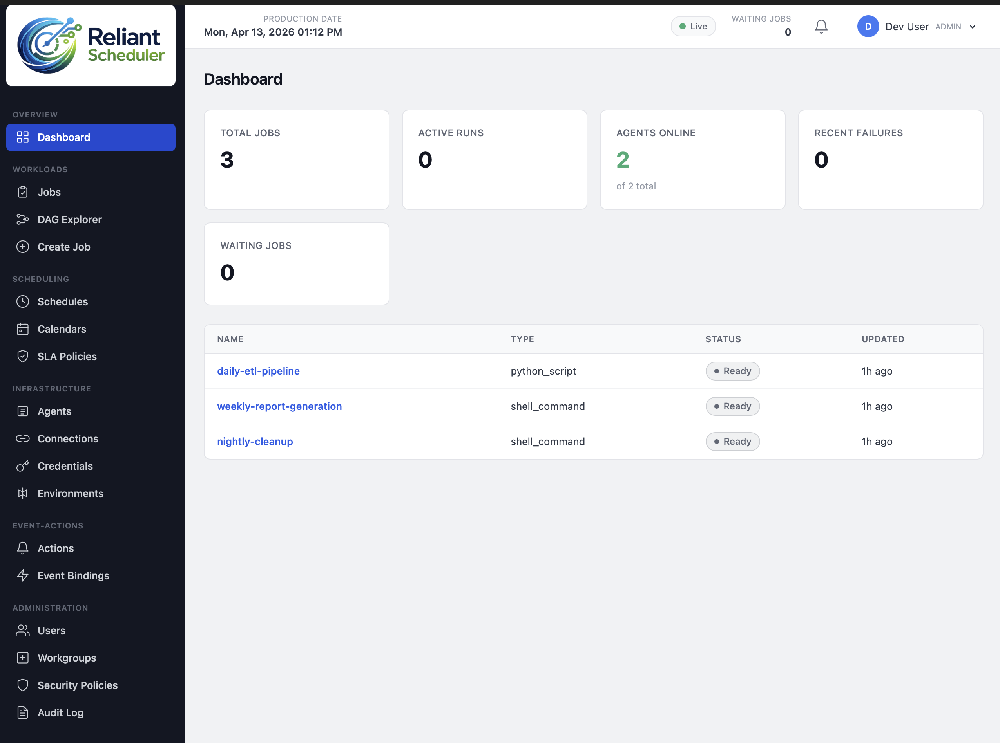

# Reliant Scheduler

Enterprise workload automation and job scheduling platform. Provides centralized orchestration of workloads across on-premises, cloud, and hybrid environments.



## Architecture

```
                    ┌──────────────┐
                    │   React UI   │  (Vite, port 5173)
                    └──────┬───────┘
                           │
                    ┌──────▼───────┐
                    │   FastAPI    │  (port 8000)
                    │   Backend    │
                    └──────┬───────┘
                           │
                    ┌──────▼───────┐
                    │  PostgreSQL  │
                    │   (v16)      │
                    └──────────────┘
```

## Tech Stack

| Layer          | Technology                            |
|----------------|---------------------------------------|
| Frontend       | React 19, TypeScript, Vite            |
| Backend        | Python 3.12, FastAPI, SQLAlchemy 2    |
| Database       | PostgreSQL 16                         |
| CI/CD          | GitHub Actions                        |

## Project Structure

```
reliant-scheduler/
├── backend/                 # FastAPI application
│   ├── src/reliant_scheduler/
│   │   ├── api/routes/      # REST endpoints
│   │   ├── core/            # Config, database
│   │   ├── models/          # SQLAlchemy models
│   │   ├── schemas/         # Pydantic schemas
│   │   ├── services/        # Business logic
│   │   └── workers/         # Background job processors
│   ├── alembic/             # Database migrations
│   ├── tests/
│   ├── Dockerfile
│   └── pyproject.toml
├── frontend/                # React application
│   ├── src/
│   │   ├── components/
│   │   ├── pages/
│   │   ├── hooks/
│   │   └── lib/
│   ├── Dockerfile
│   └── package.json
├── .github/workflows/       # CI pipelines
├── docker-compose.yml       # Local development
└── .env.example
```

## Getting Started

### Prerequisites

- Python 3.12+
- Node.js 22+
- Docker & Docker Compose

### Local Development

1. Copy environment config:
   ```bash
   cp .env.example .env
   ```
   Edit `.env` if you need to change any defaults (e.g. set `FRONTEND_PORT` to
   avoid a conflict with another process already using port 5173).

2. Start all services:
   ```bash
   docker compose up
   ```

3. Access the application (substitute your `FRONTEND_PORT` if changed):
   - Frontend: http://localhost:5173
   - Backend API: http://localhost:8000
   - API docs: http://localhost:8000/docs

### Backend Only

```bash
cd backend
pip install uv
uv pip install -e ".[dev]"
uvicorn reliant_scheduler.main:app --reload
```

### Frontend Only

```bash
cd frontend
npm install
npm run dev
```

### Running Tests

```bash
# Backend
cd backend && pytest --cov

# Frontend
cd frontend && npm run typecheck && npm run lint
```
